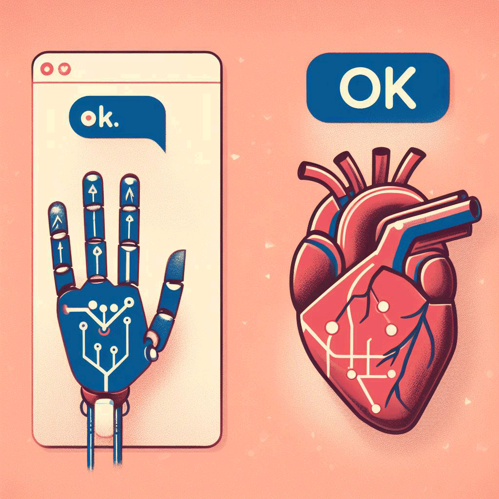

# One Word — "OK" 🐳

- [Rough Draft](rough-draft.md)
- [First Draft](first-draft.md)
- [Revision](revision.md)
- [Feedback](feedback.md)
- [Final](index.md)

## Final version

Ah, "OK". The two-letter responses — for those of ones who haven’t ever heard about this stunning word yet, poor you. Poor you, if you love to stand at the edge of blandness and confusion at the same time. 

I have no clue where it all started, but perhaps it emerged in our fast-paced world, where many of us aim to minimise our word count when replying. As a result, we've decided to truncate phrases like "I'm fine" or "Well" to a simple "O K."

Picture this: you pour your heart out to someone, spilling your deepest feelings and thoughts onto the digital canvas. You hit send, eagerly awaiting a meaningful response. You see 3 waving dots indicating that the one on the other side is writing his report. After five minutes of anticipation. You receive, "OK". No exclamation point, no heartfelt emoji, just "O K". It's like receiving a warm hug from a robot.

At first, I tried to decode the hidden meaning behind this seemingly simple word. Was it a secret way of saying, "I'm excited, but I won’t admit it" or "I’m full of emotions, but I’ll act cool"? Even so, the truth is much less impressive. It’s something like a shoulder shrug, a way of saying "Eh… whatever.". You can pour heart into a conversation, and "OK" just slams the door on any chance of having a real talk. 

I've come to one realisation. It's connected with our parents (especially gen x). Same as they are discovering beauty of traditional social medias (Facebook, YouTube, Instagram). They've also discovered beauty of some words. Words that our generation consider as an anachronism. 

Yes, I'm referring to the word "OK". My parents love to use this kind of biped word. My mum has even her own mesmerising combination: "OK" plus "thumbs up" emoji. I understand, they just try to be modern and kind as well. But let's be honest, it's the ultimate conversation killer, a linguistic underachiever. A word that makes you question whether you ever asked for a reply in the first place.

So, there’s to "OK" – the two-letter word which can both confuse and frustrate us, all while making us feel like we didn't really say anything at all. Nonetheless, it’s "OK" to dislike it, right?

