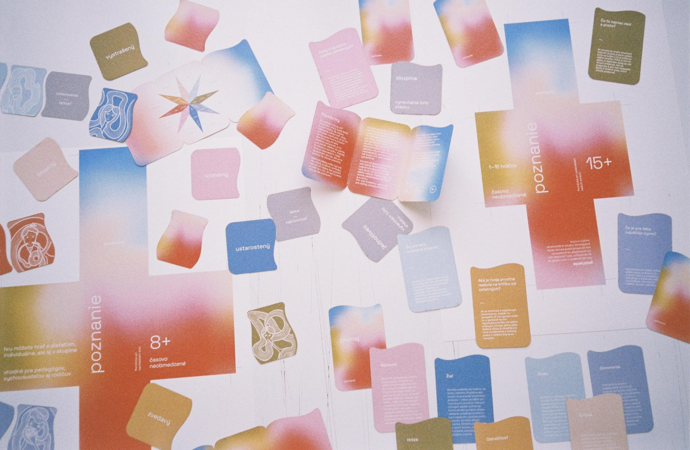

# First Impression

<!-- This is a comment, only visible to the author: Add a link to your presentation. -->
<!-- Presentations do not need to be a PDF, you may link elsewhere, such as Figma, YouTube, etc. -->
<!-- Consider adding navigation to each section (About, Featured Projects, Notes, etc.) -->

- [View Presentation](img/surname-draft-first-impression-2023.pdf)
- [About](#about)
- [Featured Projects](#featured-projects)
- [Notes](#notes)

## About

<!-- Consider including a headshot. We’re not designing, so keep the image width/height around 320px x 320px (square). Replace "surname" with your surname in the file name. -->

#### <code style="color : gold">need to decide whether leave both of the text below or just on of them</code>
I believe understanding ourselves, our identity and our purpose is the fundamental matter of life. But also one of the most challenging one.
With the design development of any product or brand identity it is quite similar — and when we reach the end of this 'seeking' process, we have a gut feeling that this is 'it'. 

I believe that every single action, every single decision, leads us in an unpredictable journey. The only way to deal with this unpredictability is to let yourself go with the flow of life and accept and operate with what life offers you. 

## Featured Projects

Currently, I am mainly involved in a digital design (web, UX & UI design) and graphic design. Each project is slightly different as this is dependent on the individual needs of each client.  
/ Nowadays, I have also started to get more involved in other spheres of design, as well as art and self-expression in general. /

### Bonclé

- Compelete web and e-shop redesign for czech manufacturing brand Bonclé. 
- The company needed to change the structure of its obsolete and user-unfriendly website to one that would make the shopping process more pleasant for its clients. 
- The website and e-shop were completely redesigned — from the user-flow to the complex UI design. My intention was to design a website with a minimalistic and elegant visual style that would highlight the uniqueness of each leather handbag and its accessories. I had to deal with a number of fairly tough moments during this project, although as always it was so enriching all round.

### Cognition (Poznanie)

- Communication card game _Cognition_ for the final work of the 2nd year of university studies.
- The task was to design / redesign pre-existing any kind of game which will carry its testimonial value.
- As a result we (my team and I) designed a psychological communication game that serves as an aid in finding words and exploring humans emotions. Prior to the actual implementation phase, we have conducted a search, including consultation with a psychologist. Within the visiual design we used color gradients, and element in the form of a wave. Both of these distinctive aspects carries its meaning:
    1. Color gradient is a symbol of emotions that blend together in different ways and are often difficult to define. However, with the help of the game we can better define them and work with them.
    2. The wave is a symbol of emotions and their development — the game should help people to alleviate highest and the most intense point of emotion.

### Rheumatism on chill (Revma v klidu)

- Digital motivational and educational course for the people who are being treated for rheumatic diseases. The project is led by the non-profit organization [_Revma Liga ČR_](https://www.revmaliga.cz/) together with the volunteer organization [_Česko.Digital_](https://cesko.digital/?gclid=Cj0KCQiAmNeqBhD4ARIsADsYfTez5yT8aah8tkRU4_I1avEtFvOxrTf6ypQ401lAcjK25XlKTM48HhEaAqdtEALw_wcB) (_Czech.Digital_), which brings together volunteers, mainly from the IT field.
- The project aims to spread the awareness of the rheumatic diseases as well as changing the form of treatment for both rheumatics and the ageing population in general.

## Notes

Numbered comments about each featured project as presenter notes or speaking points.

1. …
2. …
3. …
<!-- And so on. -->
