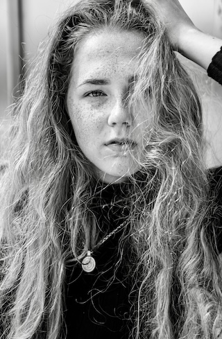

# First Impression

<!-- This is a comment, only visible to the author: Add a link to your presentation. -->
<!-- Presentations do not need to be a PDF, you may link elsewhere, such as Figma, YouTube, etc. -->
<!-- Consider adding navigation to each section (About, Featured Projects, Notes, etc.) -->

- [View Presentation](img/surname-draft-first-impression-2023.pdf)
- [About](#about)
- [Featured Projects](#featured-projects)
- [Notes](#notes)

## About

<!-- Consider including a headshot. We’re not designing, so keep the image width/height around 320px x 320px (square). Replace "surname" with your surname in the file name. -->

A short description about yourself. Think — alt text description length, a max of 125 characters, short and sweet. If you go over, that’s okay — edits are free.

I love to involve myself in deep and meaningful talks, as well as designing digital and physical products which carries higher purpose to the world.

I value designing digital products that carries higher-meaning to our world

## Featured Projects

A short description about the work.

### Featured Project 1 Title

<!-- Use a static poster image or animated GIF, but no video files. Again, keep the image width/height manageable, around 1280x x 720px (16:9 aspect ratio), or a max-width of 1280px. -->

- A short description about the project — *the what*.
- A short description about the significance of the project — *the whys*.
- A short description about the outcome of the project — *the result or takeaway*.

<!-- Use the same stucture above for the rest of your featured projects. -->

## Notes

Numbered comments about each featured project as presenter notes or speaking points.

1. …
2. …
3. …
<!-- And so on. -->
