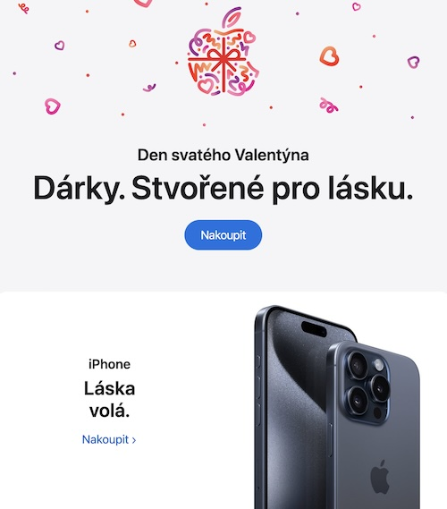
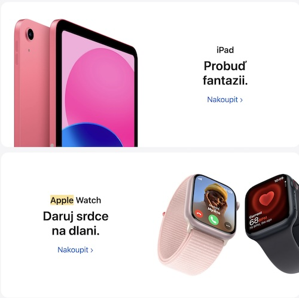
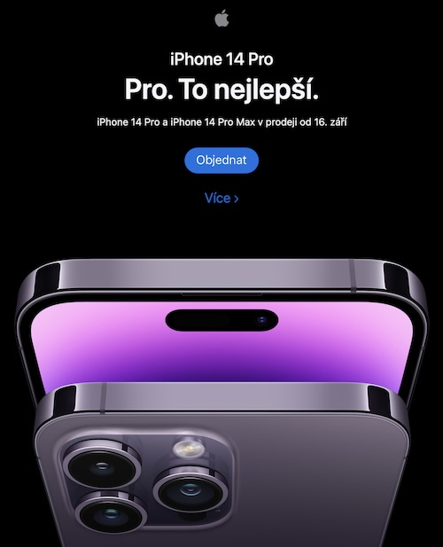

# Voice, Tone, and Style of Apple brand

<!-- Voice, Tone, and Style -->
<!-- Voice and Tone (Style, too) -->
<!-- Content Style Guide -->
<!-- Note: Even your headings can have your voice, tone, and style. -->

I chose the Apple brand not because I identify with it. Although I like using their products. I chose this brand as an example of a powerful consistent brand voice.

## Voice

Apple voice is:

- Confident; 
- Making frequent use of short sentences and bold statements (which corresponds with the design of their products) — these make the company appear assured without being arrogant;
- The brand is voice is also straightforward:
  - It’s copy is easy to understand, even when it describes the more technical elements of its products.
  - This ensures its website content and marketing materials are easy for a large audience to understand. 
  - This helps Apple appeal to as wide an audience as possible rather than seeming exclusive or exclusionary (which could be a risk with products perceived as premium or luxury items).
- Apple’s brand voice remains consistent — even on its product pages and in product description
  - Not only in marketing content and social media posts
  - Apple has a strong brand voice because it flows through everything that company publishes

## Tone
Tone is always based on the Apple’s voice — short sentence, bold statements, easy to understand, straightforward. But its tone depends on the particular audience (students, parents, older, younger etc.) or on the situation (such as Valentine's day / Releasing new product / Student sales etc.). 
See examples below.

### Valentine's Day — Example 1
- (First section translated to English: _St. Valentine's Day. Presents. Made for love._)
- (Second section translated to English: _iPhone. Love is calling._)

### Valentine's Day — Example 2
- (First section translated to English: _iPad. Awaken the imagination._)
- (Second section translated to English: _Apple Watch. Give the gift of a heart on your hand._)

### New Product Launch
- (Translated to English: _iPhone 14 Pro. For. The Best._)

### Student Sales 
- (Translated to English: _iPad and Mac. Strong study prerequisites._)

## Style

Introduction to section…

<!-- Consider including style tips on capitalization of headings (sentence or title case), words to avoid, or general grammar and mechanics dos and don’ts, etc.
See: https://styleguide.mailchimp.com/grammar-and-mechanics/-->

- …
- …
- …

