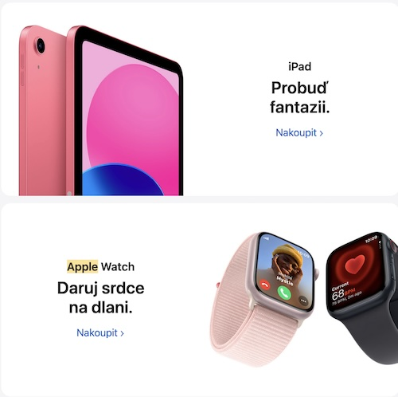

# Voice, Tone, and Style of Apple brand

<!-- Voice, Tone, and Style -->
<!-- Voice and Tone (Style, too) -->
<!-- Content Style Guide -->
<!-- Note: Even your headings can have your voice, tone, and style. -->

Malinna is one of the brands I could say "I identify with" (but not literaly — as with any kind of brand). I just enjoy its overall concept — from the products themselves, through the brand presentation to their communication with its costumers.

## Voice

Malinna voice is:

- Gentle & Calming: Mallina use gentle voice as their products are aimed mostly for woman and as the brand represents natural products.
- Grounded & Non-Expressive: Brand voice is grounded, in its it doesn’t use expressive words. It uses more plain but gentle composed sentences.
- Professional & Caring: Within the brand’s copy there is a feeling of professional product & service provider. 
- Approachable: When the brand provides more expert content, it tries to be as approachable as possible.

Examples: 
- Example: “Care does not end with the sale for us. We pay our clients individual attention. They are encouraged to consult with us or seek our advice especially if they use our products as supportive care in the treatment of their health conditions.”
- Example: “The essence. The product ingredients contain solely the highest quality raw organic oils, natural salts, essential oils and herbal infusions – their flowers, fruits, seeds, roots or the whole plants. Following the processing using no additional synthetic chemicals, the final compounds become soluble in water and fully absorbable. The natural origin of the constituents enables the organism to work with each of them effectively. It can utilise them directly and simultaneously use them to create other essential nutrients inevitable for its correct development, functioning and regeneration. The inhibiting properties of some constituents of all our products weaken the pathogens in the body and thus impede their replication. The attenuated pathogens become a library for the immune system developing resistance to them.”

## Tone
Tone is always based on the Apple’s voice — short sentence, bold statements, easy to understand, straightforward. But its tone depends on the particular audience (students, parents, older, younger etc.) or on the situation (such as Valentine's day / Releasing new product / Student sales etc.). 
See examples below.

### Valentine's Day — Example 1
- (First section translated to English: _St. Valentine's Day. Presents. Made for love._)
- (Second section translated to English: _iPhone. Love is calling._)

### Valentine's Day — Example 2
- (First section translated to English: _iPad. Awaken the imagination._)
- (Second section translated to English: _Apple Watch. Give the gift of a heart on your hand._)

### New Product Launch
- (Translated to English: _iPhone 14 Pro. For. The Best._)

### Student Sales 
- (Translated to English: _iPad and Mac. Strong study prerequisites._)

## Style

- Approchable & Straightforward: easy to understood by a wide audience — especially when speaking about in more technical terminology. 
- Confident: By using short and bold sentences Apple appear assured without being arrogant — e.g. “You’ll notice every day” and “Leaves the competition behind.”
- Consistent: brand voice flow through everything the company publishes.

