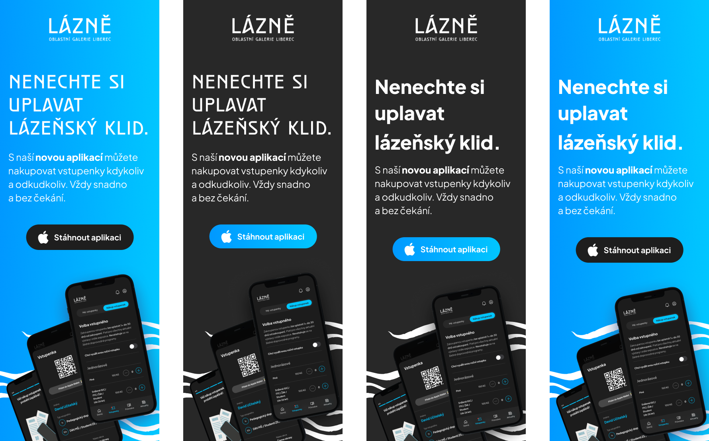

# Mobile App for the Museum of Fine Arts Liberec
### Thesis Lightning Talk

by Sara Julie Frajtová

29 April 2024

### Links —
- Download [the audio](…) <!-- Optional audio-only — think podcast. --> / to be added
- Download [the slides](assets/surname-title-slides.pdf) <!-- Link to your slides: PDF, Figma, etc. --> / to be added
- Watch [the video](…) (audio + slides) / to be added
  
## Abstract
The bachelor thesis deals with the realization of the design of a digital product, which is a mobile application for the Regional Gallery Liberec. The aim of the application is to optimize the existing digital services provided by this institution and thus increase interaction with visitors during their stay in the OGL and beyond. During the design process, emphasis was placed on creating the most user-friendly product possible. To achieve this goal, research was conducted, which included an in-depth interview. The most extensive part of the whole work is the design of the visual appearance of the application, i.e. the user interface (UI). To achieve a consistent UI, an extensive UI library was created using the Atomic design method. The UI library can be considered as input for the possible following implementation of the design system. The work also includes suggestions for the promotion of the application itself. 

## Article

### Introduction

Welcome,

My name is Sara Julie.

For my bachelor thesis I chose to create a design and implementation of a visual interface for a mobile application for the Museum of Fine Arts Liberec.

One primary motivation behind selecting the mobile app option was a wish to delve into the creation of digital products of this nature. This became as the initial impulse the selection of the topic for this bachelor thesis.

I'd like to note that developing an app for the gallery wasn't initially the intended direction. Prior to settling on the gallery concept, I envisioned developing an app centered around self-discovery. That is, an app that would address self-knowledge on a deeper level and assist its users on their journey. Ultimately, owing to the expansive nature of the subject matter, I opted to proceed with design a gallery app.

During 2023, I was actively involved in the development of the application within the _[Česko.Digital](https://en.cesko.digital/)_ community. It is a volunteer organization that brings together volunteers mainly from the IT field who work on digital projects for non-profit organizations, state administration or local government. This community is aware of the problem of obsolescence in the field of digital technologies, which consequently negatively affects the whole society. The community aims to continuously improve this situation. This experience in Česko.Digital became one of the other, secondary impulses for the realization of the bachelor thesis. 

### Theoretical Part

#### Present Circumstances 
In my hometown of Liberec, there's an art gallery renowned across the Czech Republic, drawing in visitors from neighboring regions like Czech-Poland and Czech-Germany. The institution's headquarters, an impressive landmark, underwent a full renovation and opened to the public in 2014. Despite this, as a frequent visitor myself, I've noted a shortfall in the quality of their digital services. The Museum of Fine Arts Liberec underwent a complete visual identity renewal, yet its [website](https://www.ogl.cz/en/) falls short in offering a quality user interface. This observation motivated me to address this issue to the best of my abilities. Thus, I resolved to design a mobile application aimed at enhancing this aspect.

#### What was given space in the theoretical part 
Within the theoretical segment of the thesis, I delve into UX and UI methodologies crucial for crafting a solid user experience and interface. Emphasis is placed on establishing a UI library founded upon the principles of Atomic design methodology. Additionally, I elaborate on the principles and significance of interaction design. Furthermore, I explore the intricacies of product design, specifically tailored to mobile applications as a subset of digital products. Among others, I examine the contemporary approach of museums towards digital products and services.

### Practical Part
After acquiring a sufficient theoretical foundation, one that broadened my understanding and paved the way for practical application, I embarked on the practical phase.

#### Analysis of The Current Situtation of The Gallery
At the outset of the bachelor's thesis, it was imperative to delineate the specific practical outcome the creation of which this thesis deals with. As previously mentioned, the output of the thesis constitutes a digital product. 

However, before defining the product, an analysis phase of the gallery's current situation was paramount. This analysis entailed a Desk research approach, involving gathering information primarily through online sources such as internet searches, without the necessity of field visits. This research served to establish a framework of the gallery's current digital landscape and beyond. Drawing from these insights, a preliminary concept for the digital product emerged. This phase entailed sifting through numerous relevant sources, followed by meticulous processing and evaluation of gathered data. Given the nature of the entity as a contributory organization of the Liberec Region, information was sourced not only from the institution's official website and newsletters but also from press conferences.

#### Digital product definition
Upon completion of the desk research, a preliminary concept for the digital product began to take form.

Defining the product and establishing objectives stand as pivotal starting points in the UX Design process.

This project was self-initiated, thus not commissioned by an official client. While research underpinned the entire endeavor, informing adjustments to my designs to better align with the institution's ideas and needs, the project was significantly shaped by my perception, prior experience, knowledge, and personal vision for the final product.

The initial concept for the mobile application took shape during the summer semester of 2023 as part of the Digital Design course, presented as a term paper. This concept served as a foundational framework for the bachelor thesis, where it underwent significant expansion and refinement.

#### Initial mobile app concept
The initial concept for the mobile application took shape during the summer semester of 2023 as part of the Digital Design course, presented as a term paper. This concept served as a foundational framework for the bachelor thesis, where it underwent significant expansion and refinement.

The original app concept also encompassed Desk Research, the establishment of a fundamental style library, UI development, and prototyping. Desk Research involved identifying three protopersonas, constructing a Value Proposition Canvas, and examining the current state of the gallery, including its website, information architecture, and presence on social networks. These insights laid the groundwork for a basic application framework, which proved invaluable, particularly during the preparation for in-depth interviews conducted as part of the bachelor thesis.

#### Research
Research stands as a crucial phase in the entire product design process. Among the various research activities, conducting in-depth interviews proved to be particularly significant and beneficial.

The choice of in-depth interviews as a qualitative research method was deliberate, aimed at extracting the most relevant information and data concerning the gallery while gaining deeper insights into the institution's current state. While this acquired information may not have directly influenced the modification of existing elements or the definition of additional features for the mobile application, it served as valuable input that could be further refined and developed.

Upon completion of the interview, all responses were meticulously transcribed from the tape recorder into a text document to ensure the preservation of information in the most accessible format for future reference. Concurrently, while transcribing the answers, the findings were evaluated for their potential integration into the application concept.

The insights garnered from the interview facilitated the delineation of three user protopersonas, emblematic of the primary target groups. These protopersonas are assigned fictitious names, employing a method where the surname reflects their main characteristic related to their primary need or goal.

This phase of the research involved more beyond the in-depth interview and the associated protoperson definition. Other parallel activities included a comprehensive analysis of analogous mobile applications available on the market and an proper examination of the current official gallery website.

#### Information Architecture (IA)
Following the research phase, ample information was gathered for the subsequent step: defining the product's information architecture. The insights derived from the in-depth interview facilitated the framework for determining essential functionalities within the application context, as well as identifying redundancies.

During the initial design phase of the mobile application, certain functionalities were identified for modification or removal in subsequent phases, while numerous new functionalities were primarily introduced. Both the in-depth interview and a comprehensive survey of analogous apps available in the current market contributed to this process. Additionally, the examination of the current official gallery website played a pivotal role, particularly in analyzing its structure.

The application's information architecture was structured into a User-Flow diagram, describing the user's journey towards specific actions, such as completing an order or registration. This diagram facilitated the identification of individual pages within the application and enabled the simulation of user flow throughout the application.

#### UX Design of Mobile Application
The next phase in the design process was UX design, which focused on crafting the user experience and was closely intertwined with the preceding information architecture implementation. Building upon the foundational framework established during the development of the information architecture through User-Flow diagrams, this phase delved into detailed specification through Low-Fidelity wireframes.

Low-Fidelity wireframes were predominantly created in physical form, utilizing paper and pencil. This approach was chosen for its simplicity and the flexibility it afforded. These sketches enabled the conceptualization of straightforward application layouts. While visually uncomplicated, they were nearly final in terms of structure and element placement. During this stage, the primary objective was to design diverse varianations for the application's pages, aiming to achieve the most intuitive user experience possible, ensuring user actions flowed seamlessly.

However, not all aspects of the application or functionalities required the implementation of Low-Fidelity wireframes, as certain designs were already established during the initial design phase. Conversely, others were incorporated at later stages of the process, contingent upon the continual acquisition of new knowledge aimed at optimizing the application design.

#### UI Design of Mobile Application
The UI design process could be deemed the most time-intensive phase. A crucial part of crafting High-Fidelity prototypes also involved establishing the UI library, which could serve as the cornerstone of the design system.

High-Fidelity prototypes were consistently constructed using defined components in the final phase. The Atomic design methodology was selected for implementing these prototypes. This methodology, owing to its inherent structure, facilitated automatic updates across all components affected by changes made to their foundational elements. However, this approach wasn't initially adopted, as discussed in the section addressing the application's initial design phase, resulting in some time inefficiencies but also valuable lessons learned.

##### UI Library — Atomic Design 
The Atomic design methodology, conceptualized by designer Brad Frost, presents an approach to UI design and development by delineating the process into a hierarchical structure. Inspired by the principles of chemistry, the methodology draws parallels between atoms, molecules, and organisms. Atoms combine to form molecules, which in turn assemble to create organisms. This analogy underpins the concept of Atomic Design, wherein fundamental elements progressively amalgamate into more intricate structures.

It's common practice to define subatomic elements before defining atomic elements. Subatomic elements encompass styles, such as defining the color palettes, typography, and more.

###### Subatomic Components – Various Color Palettes

###### Subatomic Components – Typography

Following the definition of subatomic styles, the identification of atoms ensued. Atoms represent styles that, akin to their namesake in chemistry, cannot be further subdivided into smaller particles. In this context, atoms encompass elements such as buttons, iconography, logos, links, text elements (for instance, those used in a calendar for making reservations), and more.

###### Atomic Components

###### Atomic Components

The subsequent stage involved crafting molecular components, which are compositions of individual atomic elements. Similar to the challenge encountered with atomic elements, distinguishing between molecular components and organisms was not always straightforward. Within the context of this mobile application, molecular components encompass inputs (such as input fields within a form), checkboxes with text, registration progress indicators, menus with buttons, page-specific headers, sliders for selecting ticket quantities, elements for playing audio recordings, image carousels, and more.

###### Molecular Components

The final step in defining the Atomic Design System involved delineating the organisms. These elements constitute the most intricate components within the methodology. Beyond organisms lie the templates and the actual content pages, which no longer adhere to the chemical analogy, thus organisms mark the culmination of component definition. Organisms consist of various repeating molecules and/or atoms, either identical or diverse. Within this mobile application, these elements encompass the registration and login form, the user account section, the On-Boarding section upon entering the application, link cards for exhibitions, events, and expositions, as well as the booking calendar pop-up window, among others.

###### Organisms 

###### Organisms 

Following the design of all components, the next step entailed integrating them into the predetermined structure of each individual page of the application. It's worth noting that this process didn't always unfold in a linear fashion.

#### High-Fidelity Prototyp
In total, 120 pages (screens) were meticulously crafted for the application, with many featuring scrollable content. Due to the vastness, I'll present only a curated selection here.

In crafting this High-Fidelity prototype, considerable attention was also dedicated to interaction design, i.e. prototyping. The overarching aim of prototyping was to render the application dynamic. The focus of the prototyping phase primarily revolved around implementing fundamental interactions for seamless navigation within the application. This stage didn't entail designing intricate interactions for every page or component. Thus, while this phase didn't entail designing intricate interactions for every page or component, I strived to achieve intuitive transitions between pages and elements when navigating or interacting with specific components.

##### Showcase — On-Boarding

##### Showcase — Sign-Up

##### Showcase — Sign-Up Incorrectly Filled Input

##### Showcase — Log-In

##### Showcase — Forgotten Password

##### Showcase — Account and Pop-Up Notification Window

##### Showcase — Homepage (List of Events) and Event Detail

##### Showcase — Event Reservation 

##### Showcase — Event Reservation 

##### Showcase — Educational Programs Reservation 

##### Showcase — Guided Tour (Tours)

##### Showcase — Guided Tour (AR)

##### Showcase — News

##### Showcase — Tickets

#### Mobile App Promotion
The gallery predominantly employs its bespoke font, _Reichenberg_, in its public communications, including the gallery logo and the internal orientation system. Therefore, incorporating this font in the promotion of the mobile app seems fitting. However, given _Reichenberg_'s lack of legibility and insufficiently contrast under certain conditions, an alternative version was proposed. In the app itself, the chosen typeface is Plus Jakarta Sans, a sans-serif font available in various weights, making it more versatile. Hence, Plus Jakarta Sans was utilized in the second (alternative) version. This font boasts readability and, with a bold weight, enhances contrast with other content, making it more visually striking even from a distance.

##### Mobile App Promotion — Website of the gallery and cooperating institutions

##### Mobile App Promotion — Website of the gallery and cooperating institutions

##### Mobile App Promotion — Website of the gallery and cooperating institutions

##### Mobile App Promotion — App Store, Widgets, Logo etc.

##### Mobile App Promotion — Social Media (Instagram)

##### Mobile App Promotion — CLV

##### Mobile App Promotion — CLV

##### Mobile App Promotion — Posters

