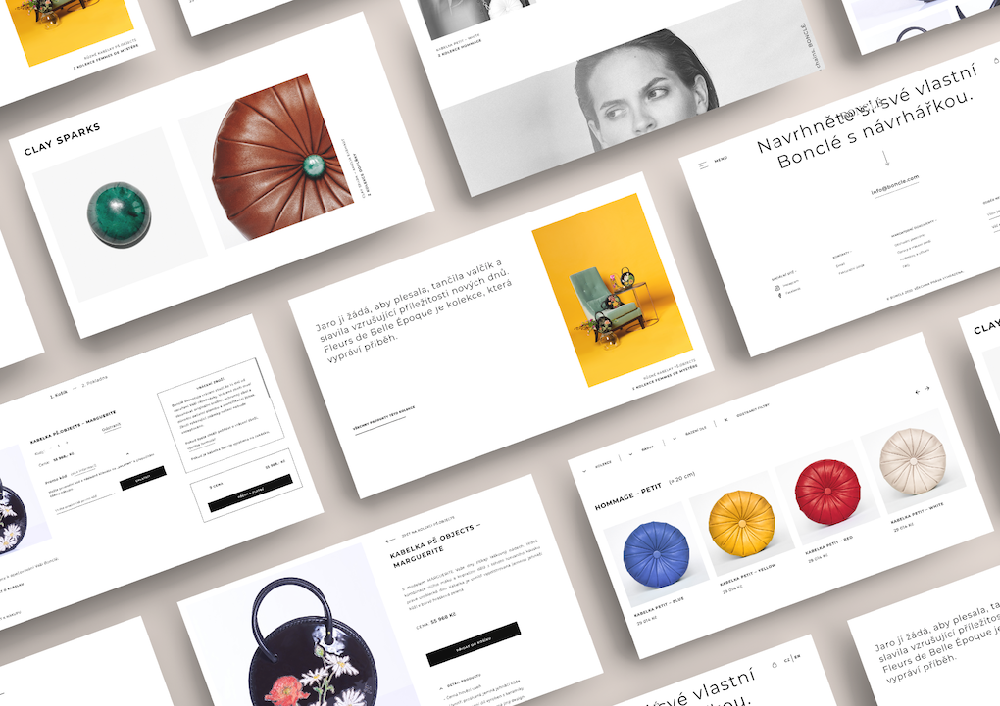
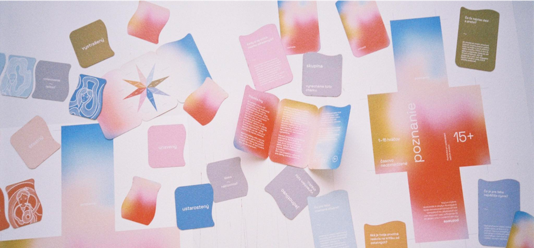
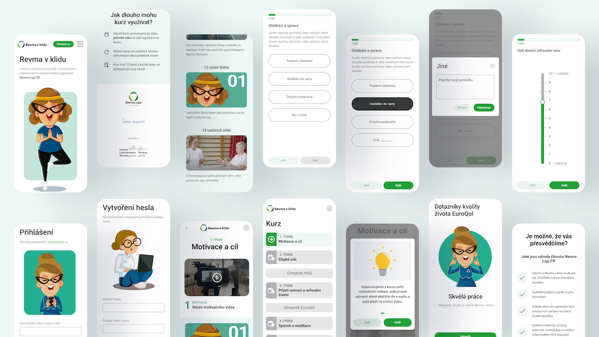

[Home](index.md) [About Me](./about.md) [Work](./work/index.md) [Writing](./writing/index.md)

# My Work

## Fields I'm working at —

1. UX, UI & WEB DESIGN
2. GRAPHIC DESIGN
3. FRONT-END DEVELOPMENT

## Feautered projects —
Currently, I am mainly involved in a digital design (web, UX & UI design) and graphic design. 
Each project is slightly different as this is dependent on the individual needs of each client.

[#### 1. Website & e-shop redesign for Bonclé](#website-and-eshop-redesign-for-Boncle)
:star: Compelete website and e-shop redesign for czech manufacturing brand Bonclé. Design that emphasizes simplicity and grandeur as a respect for the products.
 
#UXDesign #UIDesign #Webdesign
#### 2. Card Game Poznanie (Cognition)
:star: Two-leveled communication card game offering and helping its players to discover themselves, their emotions and learn to work with them in a positive manner..
 
#GrapicDesign #ConceptualDesign
#### 3. Digital course Revma v Klidu (Rheumatism on chill)
:star: Digital motivational and educational course for the people who are being treated for rheumatic diseases. Project led by the non-profit organization Revma Liga ČR together with the volunteer organization Česko.Digital (Czech.Digital)
 
#UXDesign #UIDesign
 
## Website and eshop redesign for Bonclé
UX & UI DESIGN | YEAR 2021/22

Compelete website and e-shop redesign for czech manufacturing brand Bonclé. As my very first web design project.

### Request for a change
The company needed to change the structure of its obsolete and user-unfriendly website to one that would make the shopping process more pleasant for its clients.
 
### Sublimity, Simplicity & Respect
I designed all the pages with respect to the products — in the spirit of simplicity, nobility,
but also luxury. My intetion was to let the products themselves stand out.
 
### A variety of new opportunities
The project brought me many new learning opportunities that I had never seen before. They were not always easy, but none of them were negative — they were new lessons from which I was to take away new knowledge.
 
### What has it taught me?
1. Do not underestimate the valuation of the work, devote a whole day to it.
2. Determine in advance with the customer what your job really is, you can't do all.
3. If something is beyond the scope of your work, get paid for it.
4. Conduct honest communication with the customer.
5. Get some rest. Without rest, your work won't be worthwhile.
6. There is always room for improvement, but at some point we have to say "enough is enough".

## Card game Ponznanie (Cognition) —
CONCEPTUAL DESIGN, GRAPHIC DESIGN | YEAR 2023 | TEAM WORK 

Two-leveled communication card game offering and helping its players to discover themselves, their emotions and learn to work with them in a positive manner.

### More than a game
‘Cognition’ is not just a game, but can also serve as a tool for psychotherapists in their offices. It includes two levels — the first level is designed especially for children 8+, the second is for 15+ (i.e. also for adults).
 
### Consultation with a specialist
Before implementing the actual visual style of the game, we conducted research and consulted with an expert in the field of psychology. By doing this, we obtained a lot of new insights into how to best design the game.
 
### Exploring & understanding emotions
In the first level (8+), the game begins with the child choosing a card with an illustration that embodies the emotion which had experienced. After a while of observation, the child tries to name that emotion (or vice versa).  Following that, there is a step of defing needs which are connected to that emotion and name them. This principle is applied to other card sets. 

The process of defining emotions is not easy, so it is also suitable for adults.
 
### What has it taught me?
1. Devote yourself to what fulfills you, what is meaningful to you. Only at this point you will be in an aligment with what you are creating.
2. Genuine friends will always tell you the truth when they feel you are unconsciously wounding yourself.
3. Our spirit is an essential part of our health routine.

## Revma v klidu (Rheumatism on chill) —
UX DESIGN | YEAR 2023 | TEAM-COMMUNITY WORK (ČESKO.DIGITAL)  

Digital motivational and educational course for the people who are being treated for rheumatic diseases. The project is led by the non-profit organization Revma Liga ČR together with the volunteer organization Česko.Digital (Czech.Digital)

### Community with the aim to help
My compulsory internship led me to work on this project, when I was looking for a junior UX or UI designer position. Thanks to my teacher I discovered the volunteer community Česko.Digital, which brings together volunteers mainly from the IT field. I was offered a volunteer position as a junior UX designer on the Revma v Klidu project.
 
### Unique aid in the form of an app
The project aims to spread the awareness of the rheumatic diseases as well as changing the form of treatment for both rheumatics and the ageing population in general. It will help to initiate motivation to exercise at home even in people who do not have the opportunity to exercise with professional assistance for a long time.
 
### Many challenges, many opportunities
I've been contributing as junior UX designer, whereby I was leaded by senior UX designer. Thanks to this opportunity, I have gained a lot of new expriences — from user research (in-depth user interviews & etc.) to user testing, as well as working in an interprofessional team. Besides that, it has taught the importance of expressing my opinion about the addressed topic.
 
### From silence to self-expression
At the very beginning of the whole project I was in a situation where I was unable to say a word, I was so intimidated, punishing myself, constantly underestimating my human value. Whenever I had to express my opinion on a topic, I felt that I was not competent enough to present my point of view.

However, through the process of life, I've learned (at least halfway through) that I shouldn't be afraid to voice my opinion.
 
### What has it taught me?
1. Do not underestimate your personal value.2. Genuine friends will always tell you the truth when they feel you are unconsciously wounding yourself.
2. Ask your colleagues for a help/opinion whenever you need it. You are not competent to know everything. Don't be afraid to be the ‘dumbest’ in the room — you’re never actually a  dumb, it's just your ego that thinks you are.
3. Explore new, less unpredictable journeys, the power of serendipity is marvellous.
