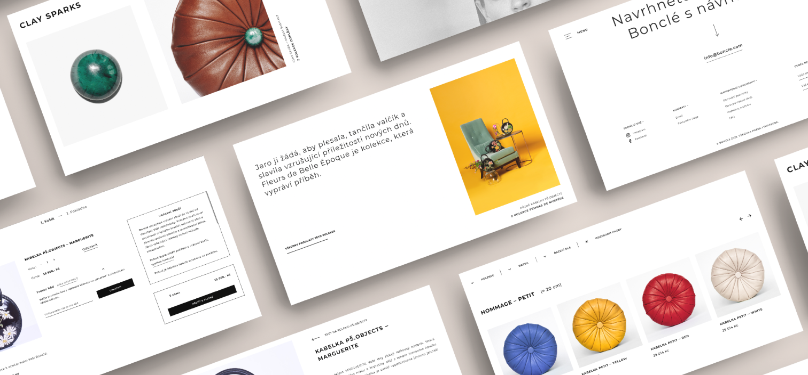

[Home](index.md) [About Me](./about.md) [Work](./work/index.md) [Writing](./writing/index.md)

# My Work

## Fields I'm working at —

1. UX, UI & WEB DESIGN
2. GRAPHIC DESIGN
3. FRONT-END DEVELOPMENT
   
## Feautered projects —
Currently, I am mainly involved in a digital design (web, UX & UI design) and graphic design. 
Each project is slightly different as this is dependent on the individual needs of each client.

#### 1. Website & e-shop redesign for Bonclé
:star: Compelete website and e-shop redesign for czech manufacturing brand Bonclé. Design that emphasizes simplicity and grandeur as a respect for the products.
 
#UXDesign #UIDesign #Webdesign
#### 2. Card Game Poznanie (Cognition)
:star: Two-leveled communication card game offering and helping its players to discover themselves, their emotions and learn to work with them in a positive manner..
 
#GrapicDesign #ConceptualDesign
#### 3. Digital course Revma v Klidu (Rheumatism on chill)
:star: Digital motivational and educational course for the people who are being treated for rheumatic diseases. Project led by the non-profit organization Revma Liga ČR together with the volunteer organization Česko.Digital (Czech.Digital)
 
#UXDesign #UIDesign
 
## Website & e-shop redesign for Bonclé —
UX & UI DESIGN | YEAR 2021/22

Compelete website and e-shop redesign for czech manufacturing brand Bonclé. As my very first web design project.

### Request for a change
The company needed to change the structure of its obsolete and user-unfriendly website to one that would make the shopping process more pleasant for its clients.
 
### Sublimity, Simplicity & Respect
I designed all the pages with respect to the products — in the spirit of simplicity, nobility,
but also luxury. My intetion was to let the products themselves stand out.
 
### What has it taught me?
