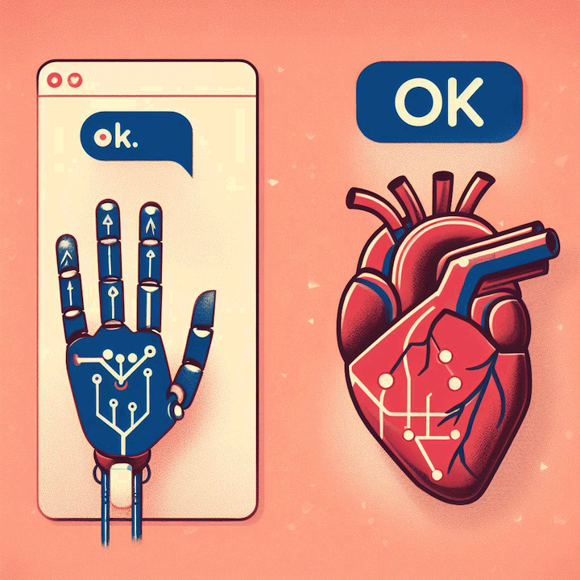

# One Word — "OK" 🐳

by Sára Julie Frajtová | 22nd of November 2023

“OK” — the two-letter response — for those who have yet heard of this *stunning* word. Ah, poor you, if you love to stand at the edge of blandness and confusion at the same time.

I have no clue where it all started, but perhaps it emerged in our fast-paced world, where many of us aim to minimise our word count when replying. As a result, we've decided to truncate phrases like "I'm fine" or "Well" to a simple "O K."

**Picture this**: You pour your heart out to someone, spilling your deepest feelings and thoughts onto the digital canvas. You hit send, eagerly awaiting a meaningful reply. You see three bouncing dots (•••) indicating that the one on the other side is writing their report. After five minutes of anticipation, you receive, “OK”. No exclamation point, no heartfelt emoji, nothing. Just an “OK” — a big warm hug from a robot.

At first, I tried to decode the hidden meaning behind this seemingly simple word. Was it a secret way of saying, “I’m excited, but I won’t admit it.” or “I’m full of emotions, but I’ll act cool?” Even so, the truth is much less impressive. It was something like a shoulder shrug, a way of saying, “Eh… whatever.” You can pour heart out, and “OK” just slams the door on any chance of having any real conversation.

I’ve come to that realisation that it’s connected with our parents (Gen X, okay). Same as they are discovering the beauty of traditional social media (Facebook, Instagram, YouTube). And they’ve discovered the beauty of some words. Words that our generation may consider old-fashioned or outdated.

Yes, I’m referring to the word “OK”. My parents love to use this biped (two-legged) word. My mum even has her own mesmerizing combo, a real one-two punch: “OK” plus a “thumbs up” emoji. I understand it, she’s trying to be cool and kind at the same time. But let’s be honest, it’s the ultimate conversation killer, an epic text fail. It’s a word that makes you question whether you ever asked for a reply in the first place.

So, here’s to “OK” – the two-letter word, phrase, and catch-all reply for everything. To confuse and frustrate us, all while making us feel like we didn’t really say anything at all. Yet, it’s okay to dislike it, right? I mean — *OK*.

